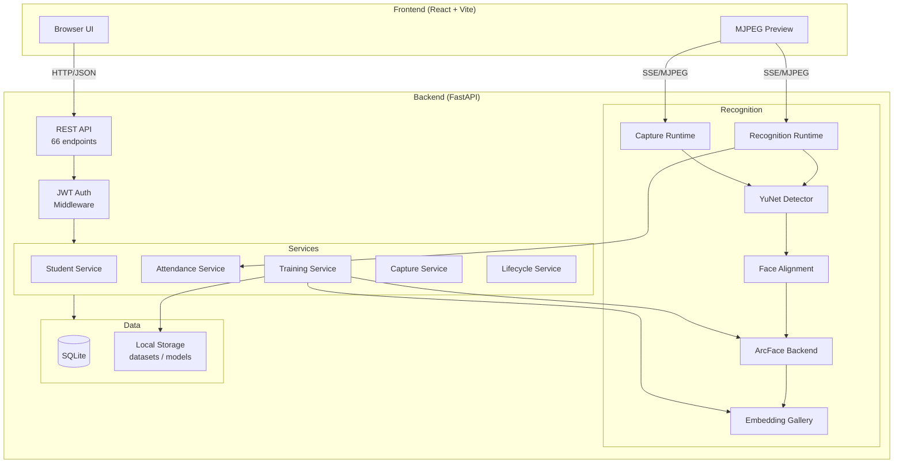

# VisionAttend

**A Computer Vision-Based Attendance Management Platform**

VisionAttend is a full-stack desktop application that automates student attendance tracking using face detection and recognition. It replaces manual roll-call with a camera-based system where students are identified in real time during class sessions. The platform manages the complete workflow: student enrollment with guided face capture, model training, live recognition sessions, attendance record keeping, and academic lifecycle operations.

Built as an MCA major project, VisionAttend targets single-institution deployment on a local desktop machine with a webcam.

---

## Key Features

### Authentication and Access Control
- JWT-based authentication with access and refresh tokens
- Two roles: **Administrator** (full system access) and **Faculty** (scoped to assigned classes)
- Single-admin model: one system owner, unlimited faculty accounts

### Student Management
- Student profiles with name, roll number, department, email, phone
- Class assignment with lifecycle status tracking
- Bulk selection with batch delete operations
- Status filtering (active, graduated, inactive)

### Faculty Management
- Admin creates and manages faculty accounts
- Faculty-to-class assignment (many-to-many)
- Faculty can only view and operate on their assigned classes

### Academic Class Management
- Classes defined by major, year, section, and academic year
- Auto-generated class codes (e.g., `MCA-2026-Y1-A`)
- Unique constraint on `(major, year, section, academic_year)` prevents duplicates
- Batch operations via checkbox selection: promote, graduate, activate, deactivate, delete

### Guided Dataset Capture
- 4-phase biometric enrollment: Front, Right, Left, Front Again
- 5 quality-gated samples per phase (20 images total per student)
- Real-time quality checks: minimum face ratio, center alignment, detection stability
- Live MJPEG preview with phase instructions overlaid on the video feed

### Face Recognition
- Dual-backend architecture supporting LBPH and ArcFace
- YuNet face detector with 5-point facial landmark extraction
- ArcFace embedding extraction (512-dimensional vectors)
- Cosine similarity matching against an in-memory gallery
- Identity validation gate rejects graduated/inactive students at recognition time

### Attendance Sessions
- Session-based workflow: start session (scoped to a class), run recognition, stop session
- Two-layer duplicate prevention: 8-second in-memory cooldown per student + per-day database dedup
- Live recognition feed with annotated MJPEG video stream
- Per-session attendance listing and CSV export

### Model Training and Versioning
- On-demand training triggered by admin
- Up to 3 model versions retained on disk
- Active model promotion and rollback to any previous version
- Stale model detection with dashboard warnings when students are added/removed/graduated

### Academic Lifecycle Management
- Student statuses: `active` → `graduated` | `inactive` (reversible)
- **Promotion**: auto-resolves target class (same major, section, year+1). Supports both cohort-span (`2026-30`) and single-year (`2026-27`) academic year conventions
- **Batch Promotion**: promote or graduate all classes in a major with a single operation. Final-year classes are graduated automatically based on program duration (MCA=2yr, BCA=3yr, BTech=4yr)
- **Graduation**: single student, single class, or batch. Generates a `lifecycle_batch_id` for undo
- **Restore**: individual student or entire batch. Students require model retraining after restoration
- All operations preserve attendance history

### Session History and Reporting
- Filterable by date range, faculty, and class
- Per-session detail view with attendance list
- CSV export per session
- Bulk session deletion

---

## Recognition Pipeline

```
Camera Frame
    │
    ▼
┌──────────────────┐
│   YuNet Detector  │  Face detection + 5-point landmark extraction
│   (OpenCV DNN)    │  Confidence threshold: 0.7
└────────┬─────────┘
         │
         ▼
┌──────────────────┐
│  Face Alignment   │  Affine warp to 112x112 canonical position
│  (5-pt landmarks) │  using insightface reference coordinates
└────────┬─────────┘
         │
         ▼
┌──────────────────┐
│  ArcFace Backbone │  MobileFaceNet ONNX model (w600k_r50)
│  (512-d embedding)│  Produces a normalized embedding vector
└────────┬─────────┘
         │
         ▼
┌──────────────────┐
│ Cosine Similarity │  Brute-force search against gallery matrix
│ Gallery Matching  │  Threshold: 0.45 (floor) + 0.65 (gate)
└────────┬─────────┘
         │
         ▼
┌──────────────────┐
│ Identity Validator│  Checks student status == 'active'
│ + Cooldown Gate   │  8-second per-student cooldown
└────────┬─────────┘
         │
         ▼
   Attendance Record
```

**Legacy support**: LBPH (Local Binary Pattern Histograms) with Haar cascade detector remains fully functional and selectable via `RECOGNITION_BACKEND=lbph` in the environment configuration.

---

## Technology Stack

| Layer | Technology | Version |
|-------|-----------|---------|
| **Frontend** | React | 18.3.1 |
| | Vite | 5.4.9 |
| | Tailwind CSS | 3.4.13 |
| | Axios | 1.7.7 |
| | React Router | 6.27.0 |
| | Lucide React (icons) | 0.453.0 |
| | Framer Motion | 11.11.9 |
| **Backend** | Python | 3.12 |
| | FastAPI | 0.115.0 |
| | SQLAlchemy | 2.0.35 |
| | Pydantic | 2.9.2 |
| | Uvicorn | 0.30.6 |
| **Database** | SQLite | (local file) |
| **Recognition** | OpenCV | 4.10.0 |
| | NumPy | 1.26.4 |
| | ONNX Runtime | via OpenCV DNN |
| **Authentication** | python-jose (JWT) | 3.3.0 |
| | bcrypt | 4.2.0 |

---

## System Architecture



---

## Installation

### Prerequisites

- Python 3.10+
- Node.js 18+
- Webcam (for capture and recognition)

### Backend Setup

```bash
cd backend

# Create virtual environment
python -m venv venv
venv\Scripts\activate        # Windows
# source venv/bin/activate   # macOS/Linux

# Install dependencies
pip install -r requirements.txt

# Run the server
python run.py
```

The backend starts at `http://127.0.0.1:8000`. On first run, SQLite database and schema migrations execute automatically. A default admin account is created (check startup logs for credentials).

### Frontend Setup

```bash
cd frontend

# Install dependencies
npm install

# Start development server
npm run dev
```

The frontend starts at `http://localhost:5173`.

### Environment Configuration

Create a `.env` file in the repository root:

```env
# Application
APP_NAME=VisionAttend
APP_ENV=development
APP_VERSION=1.0.0
API_V1_PREFIX=/api/v1

# Server
HOST=127.0.0.1
PORT=8000
DEBUG=true

# Security (generate a strong secret for production)
JWT_SECRET_KEY=replace-with-a-strong-random-secret
JWT_ALGORITHM=HS256
JWT_ACCESS_TOKEN_EXPIRE_MINUTES=60

# CORS
CORS_ORIGINS=["http://localhost:5173","http://127.0.0.1:5173"]

# Storage
STORAGE_DIR=./data/storage

# Frontend
VITE_API_BASE_URL=http://127.0.0.1:8000/api/v1
```

### API Documentation

Once the backend is running:

- Swagger UI: `http://127.0.0.1:8000/docs`
- ReDoc: `http://127.0.0.1:8000/redoc`
- Health check: `http://127.0.0.1:8000/health`

---

## Project Structure

```
VisionAttend/
├── backend/
│   ├── run.py                          # Uvicorn entry point
│   ├── requirements.txt
│   └── app/
│       ├── main.py                     # FastAPI app factory
│       ├── config/
│       │   ├── constants.py            # Program durations, API tags
│       │   ├── settings.py             # Pydantic settings (env-based)
│       │   └── security.py             # JWT token creation/verification
│       ├── core/
│       │   ├── dependencies.py         # DI: DB session, role guards
│       │   ├── exceptions.py           # Global exception handlers
│       │   ├── lifespan.py             # Startup/shutdown lifecycle
│       │   ├── logging.py              # Structured logging setup
│       │   └── middleware.py           # CORS, request logging
│       ├── database/
│       │   ├── db.py                   # Engine + session factory
│       │   ├── base.py                 # Declarative base
│       │   ├── migrations/
│       │   │   └── runner.py           # Auto-migrating schema (7 migrations)
│       │   ├── models/                 # SQLAlchemy ORM models
│       │   │   ├── user.py
│       │   │   ├── student.py
│       │   │   ├── academic_class.py
│       │   │   ├── faculty_class.py
│       │   │   ├── attendance_session.py
│       │   │   └── attendance.py
│       │   └── schemas/                # Pydantic request/response schemas
│       ├── recognition/
│       │   ├── runtime.py              # Recognition loop (threaded)
│       │   ├── capture_runtime.py      # Guided enrollment loop (threaded)
│       │   ├── pipeline.py             # Detector + backend orchestration
│       │   ├── detector.py             # Legacy Haar detector
│       │   ├── detectors/
│       │   │   ├── yunet_detector.py   # YuNet DNN detector
│       │   │   ├── haar_detector.py    # Haar cascade fallback
│       │   │   └── model_downloader.py # Auto-download ONNX models
│       │   ├── alignment.py            # 5-point affine face alignment
│       │   ├── backends/
│       │   │   ├── arcface_backend.py  # ArcFace ONNX embedding
│       │   │   └── lbph_backend.py     # OpenCV LBPH recognizer
│       │   ├── gallery.py              # NumPy embedding gallery + search
│       │   ├── model_manager.py        # Version registry, promote, rollback
│       │   ├── identity_validator.py   # Active-status gate
│       │   ├── cooldown.py             # Per-student recognition cooldown
│       │   ├── capture_quality.py      # Quality evaluator for enrollment
│       │   └── frame_tracker.py        # Multi-face tracking across frames
│       ├── routes/                     # FastAPI routers (14 modules)
│       │   ├── auth.py                 # Login, me, change-password
│       │   ├── students.py             # CRUD + bulk delete
│       │   ├── classes.py              # Academic class CRUD
│       │   ├── users.py                # Faculty account management
│       │   ├── dataset.py              # Image upload/delete
│       │   ├── training.py             # Train, status, versions, rollback
│       │   ├── recognition.py          # Start/stop recognition
│       │   ├── capture.py              # Start/stop guided capture
│       │   ├── attendance.py           # Attendance records CRUD
│       │   ├── sessions.py             # Session history, export, delete
│       │   ├── lifecycle.py            # Promote, graduate, restore
│       │   ├── preview.py              # MJPEG recognition stream
│       │   ├── capture_preview.py      # MJPEG capture stream
│       │   └── health.py               # Health check
│       ├── services/                   # Business logic (14 modules)
│       └── storage/
│           └── local.py                # Filesystem operations
│
├── frontend/
│   ├── index.html
│   ├── package.json
│   ├── vite.config.js
│   ├── tailwind.config.js
│   └── src/
│       ├── App.jsx
│       ├── main.jsx
│       ├── index.css                   # Tailwind base + custom styles
│       ├── components/
│       │   ├── attendance/             # Live attendance UI (23 components)
│       │   ├── capture/                # Guided enrollment UI (8 components)
│       │   ├── classes/                # Class lifecycle dialogs (4 components)
│       │   ├── common/                 # Shared UI primitives (28 components)
│       │   ├── dashboard/              # Admin + Faculty dashboards (8 components)
│       │   ├── datasets/               # Dataset gallery + upload (6 components)
│       │   ├── layout/                 # Sidebar, Header (2 components)
│       │   ├── students/               # Student table + forms (8 components)
│       │   └── training/               # Training controls (5 components)
│       ├── context/                    # React Context providers
│       │   ├── AuthContext.jsx
│       │   ├── ClassContext.jsx
│       │   └── ToastContext.jsx
│       ├── hooks/                      # Custom React hooks (8 hooks)
│       ├── pages/                      # Route-level page components (14 pages)
│       ├── routes/                     # Route definitions + guards
│       ├── services/                   # API client modules (11 services)
│       └── utils/                      # Formatting, classnames
│
├── .env                                # Local environment (not committed)
├── .gitignore
└── README.md
```

---

## User Roles

### Administrator

| Capability | Description |
|-----------|-------------|
| Full student CRUD | Create, edit, delete students; manage datasets |
| Class management | Create, edit, activate/deactivate, delete classes |
| Faculty management | Create faculty accounts, assign to classes, reset passwords |
| Model training | Trigger training runs, manage model versions, rollback |
| Recognition sessions | Start/stop sessions for any class |
| Attendance management | View, export, bulk-delete attendance records |
| Academic lifecycle | Promote, graduate, deactivate, restore students and classes |
| Dataset capture | Run guided enrollment capture for any student |

### Faculty

| Capability | Description |
|-----------|-------------|
| Assigned classes only | All views scoped to classes assigned by admin |
| Recognition sessions | Start/stop sessions for assigned classes |
| Attendance viewing | View attendance records for assigned classes |
| Student viewing | View student profiles in assigned classes |
| Dataset capture | Run guided enrollment for students in assigned classes |

---

## Academic Lifecycle

### Student Status Flow

```
                    ┌─────────────────┐
          Restore   │                 │  Graduate
       ┌───────────►│     Active      ├──────────────┐
       │            │                 │              │
       │            └────────┬────────┘              ▼
       │                     │               ┌──────────────┐
       │              Deactivate             │  Graduated   │
       │                     │               │              │
       │                     ▼               └──────┬───────┘
       │            ┌────────────────┐              │
       │            │    Inactive    │              │ Restore
       │            │               │◄─────────────┘
       │            └───────┬───────┘
       │                    │
       └────────────────────┘
```

### Promotion Logic

1. Admin selects classes (checkboxes) or uses "Promote major" action
2. System generates a **promotion preview** showing each class's action:
   - **Promote**: non-final-year classes → auto-resolved target (same major, section, year+1)
   - **Graduate**: final-year classes (year >= program duration) → batch graduation
   - **Skip**: classes with no active students
3. Admin reviews the plan and executes
4. Promotions change only `class_id` on student rows. Datasets, embeddings, and attendance history are untouched. No retraining required.

### Program Durations

| Program | Duration (Years) |
|---------|-----------------|
| MCA | 2 |
| BCA | 3 |
| BTech / B.Tech | 4 |
| MTech / M.Tech | 2 |
| MBA | 2 |
| BSc / B.Sc | 3 |
| MSc / M.Sc | 2 |

---

## Model Management

### Training Pipeline

1. Admin triggers training via the dashboard
2. System scans all active students' dataset folders
3. For each student with images:
   - **LBPH**: Loads grayscale images, trains OpenCV `LBPHFaceRecognizer`, saves `trainer.yml`
   - **ArcFace**: Extracts 512-d embeddings per image, builds a NumPy gallery matrix, saves `gallery.npz`
4. Labels and metadata saved alongside the model artifacts
5. New version is promoted to active; oldest versions pruned beyond the retention limit

### Version Management

| Feature | Implementation |
|---------|---------------|
| Retained versions | 3 (configurable via `MODEL_MAX_RETAINED_VERSIONS`) |
| Storage format | `trainer.yml` + `gallery.npz` + `labels.json` + `metadata.json` |
| Rollback | Instant pointer swap to any retained version |
| Stale detection | Dashboard warns when students added/removed/graduated since last training |

---

## Database Schema

| Table | Purpose |
|-------|---------|
| `users` | Admin and faculty accounts |
| `students` | Student profiles with lifecycle fields |
| `academic_classes` | Class definitions (major, year, section, academic_year) |
| `faculty_classes` | Faculty-to-class assignment (junction table) |
| `attendance_sessions` | Session metadata (class, faculty, start/end time) |
| `attendance` | Individual attendance records (student, session, confidence, timestamp) |
| `_schema_migrations` | Migration version tracking |

Migrations run automatically on startup. The schema currently includes 7 migrations covering the initial schema through lifecycle field additions.

---

## API Overview

The backend exposes **66 endpoints** across 14 route modules, all under `/api/v1/`:

| Module | Endpoints | Auth | Description |
|--------|----------|------|-------------|
| `auth` | 3 | Public/Auth | Login, current user, change password |
| `students` | 6 | Faculty+ | CRUD, bulk delete |
| `dataset` | 4 | Admin | Image upload, list, delete |
| `training` | 6 | Admin | Train, status, versions, rollback, delete |
| `recognition` | 3 | Faculty+ | Start, stop, status |
| `capture` | 3 | Faculty+ | Start, stop, status |
| `attendance` | 5 | Faculty+ | List, detail, delete, bulk delete, student history |
| `sessions` | 6 | Faculty+ | List, detail, attendance, export CSV, delete, bulk delete |
| `classes` | 5 | Faculty+/Admin | CRUD, faculty listing |
| `users` | 7 | Admin | Faculty CRUD, class assignment, password reset |
| `lifecycle` | 9 | Admin | Promote, graduate, deactivate, restore, preview, programs |
| `preview` | 1 | Faculty+ | MJPEG recognition stream |
| `capture_preview` | 1 | Faculty+ | MJPEG capture stream |
| `health` | 1 | Public | Health check |

Full interactive documentation available at `/docs` (Swagger UI) and `/redoc` when the backend is running.

---

## Screenshots

> Screenshots to be added after final UI review.

| Screen | Description |
|--------|-------------|
| Login | JWT authentication with role-based redirect |
| Admin Dashboard | Class cards grouped by major, runtime status, model health |
| Faculty Dashboard | Assigned classes, quick session start |
| Students | Filterable student list with status badges, bulk selection |
| Dataset Manager | Image gallery with upload dropzone and guided capture |
| Guided Capture | 4-phase enrollment with live preview and quality indicators |
| Live Attendance | MJPEG preview, recognition feed, session controls |
| Training | Training status, active model info, version history with rollback |
| Session History | Date and faculty filters, CSV export |
| Academic Classes | Batch selection toolbar with promote/graduate/activate/delete |
| Promotion Preview | Auto-resolved promotion plan with target class validation |

---

## Future Enhancements

- **PostgreSQL migration**: Connection string is already configurable; schema is ORM-managed
- **Electron packaging**: CORS origins include `app://` and `file://` schemes for desktop distribution
- **Multi-camera support**: Runtime architecture supports camera index configuration
- **Attendance analytics**: Per-student and per-class attendance percentage dashboards
- **Export formats**: PDF attendance reports alongside existing CSV export
- **Notification system**: Email/SMS alerts for low attendance thresholds

---

## License

This project was developed as an MCA major project at the Department of Computer Applications.

---

*VisionAttend: A Computer Vision-Based Attendance Management Platform*
